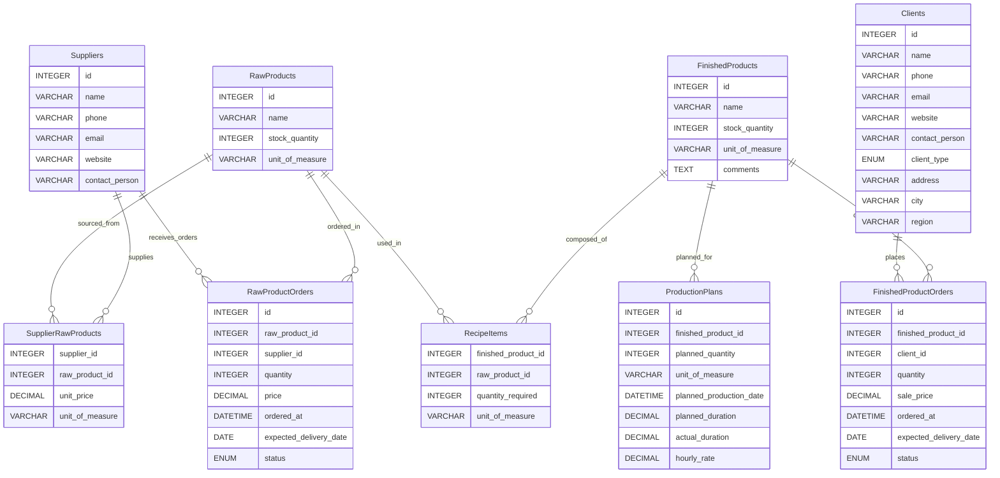

# Stocky Backend API

**Stocky — Track. Manage. Grow.**

A comprehensive inventory management REST API designed for managing stock, suppliers, clients, production plans, and orders.

## Description

Stocky is a full-featured backend API built for inventory management systems. It provides endpoints to manage:

- **Raw Products**: Track raw materials and their stock levels
- **Suppliers**: Manage supplier information and their product offerings
- **Finished Products**: Track manufactured/finished goods
- **Clients**: Manage customer information (individuals, grocery stores, restaurants)
- **Orders**: Handle both raw product orders (from suppliers) and finished product orders (to clients)
- **Recipes**: Define recipes linking raw products to finished products
- **Production Plans**: Plan and track production schedules

## Tech Stack

| Technology       | Purpose                                              |
| ---------------- | ---------------------------------------------------- |
| **Bun**          | JavaScript runtime for running the server            |
| **Express.js 5** | Web framework for building the REST API              |
| **TypeScript**   | Type-safe JavaScript for better developer experience |
| **MySQL**        | Relational database for data persistence             |
| **mysql2**       | MySQL client for Node.js/Bun                         |
| **CORS**         | Cross-Origin Resource Sharing middleware             |
| **dotenv**       | Environment variable management                      |
| **Nodemon**      | Development server with hot reload                   |

## Project Structure

```
stocky_backend/
├── src/
│   ├── config/           # Database configuration
│   ├── controllers/v1/   # Route handlers
│   ├── error/            # Custom error classes
│   ├── helpers/          # Utility functions
│   ├── middlewares/      # Express middlewares
│   ├── routes/v1/        # API route definitions
│   ├── services/         # Business logic & database queries
│   ├── types/            # TypeScript type definitions
│   └── server.ts         # Application entry point
├── package.json
└── tsconfig.json
```

## Prerequisites

- [Bun](https://bun.sh/) (latest version)
- [MySQL](https://www.mysql.com/) (v8.0+)

## Installation

1. **Clone the repository**

   ```bash
   git clone <repository-url>
   cd stocky_backend
   ```

2. **Install dependencies**

   ```bash
   bun install
   ```

3. **Set up the database**

   Create the database and tables using the provided SQL script:

   ```bash
   mysql -u your_username -p < src/config/db_init.sql
   ```

4. **Configure environment variables**

   Create a `.env` file in the root directory:

   ```env
   PORT=3000
   DB_HOST=localhost
   DB_USER=your_username
   DB_PASSWORD=your_password
   DB_NAME=stocky_db
   FRONTEND_URL=http://localhost:5173
   ```

5. **Run the server**

   Development mode (with hot reload):

   ```bash
   bun run dev
   ```

   Production mode:

   ```bash
   bun run start
   ```

6. **Build for production**
   ```bash
   bun run build
   ```

## API Endpoints

Base URL: `http://localhost:3000/api/v1`

### Root

| Method | Endpoint | Description                           |
| ------ | -------- | ------------------------------------- |
| GET    | `/`      | API welcome message and endpoint list |

---

### Raw Products

| Method | Endpoint            | Description              |
| ------ | ------------------- | ------------------------ |
| GET    | `/raw-products`     | Get all raw products     |
| GET    | `/raw-products/:id` | Get a raw product by ID  |
| POST   | `/raw-products`     | Create a new raw product |
| PUT    | `/raw-products/:id` | Update a raw product     |
| DELETE | `/raw-products/:id` | Delete a raw product     |

**Request Body (POST/PUT):**

```json
{
  "name": "Product Name",
  "stock_quantity": 100,
  "unit_of_measure": "kg"
}
```

---

### Suppliers

| Method | Endpoint                      | Description                      |
| ------ | ----------------------------- | -------------------------------- |
| GET    | `/suppliers`                  | Get all suppliers                |
| GET    | `/suppliers/:id`              | Get a supplier by ID             |
| GET    | `/suppliers/:id/raw-products` | Get raw products from a supplier |
| POST   | `/suppliers`                  | Create a new supplier            |
| PUT    | `/suppliers/:id`              | Update a supplier                |
| DELETE | `/suppliers/:id`              | Delete a supplier                |

**Request Body (POST/PUT):**

```json
{
  "name": "Supplier Name",
  "phone": "+1234567890",
  "email": "supplier@email.com",
  "website": "https://supplier.com",
  "contact_person": "John Doe"
}
```

---

### Finished Products

| Method | Endpoint                        | Description                       |
| ------ | ------------------------------- | --------------------------------- |
| GET    | `/finished-products`            | Get all finished products         |
| GET    | `/finished-products/:id`        | Get a finished product by ID      |
| GET    | `/finished-products/:id/recipe` | Get recipe for a finished product |
| POST   | `/finished-products`            | Create a new finished product     |
| PUT    | `/finished-products/:id`        | Update a finished product         |
| DELETE | `/finished-products/:id`        | Delete a finished product         |

**Request Body (POST/PUT):**

```json
{
  "name": "Product Name",
  "stock_quantity": 50,
  "unit_of_measure": "unit",
  "comments": "Optional comments"
}
```

---

### Clients

| Method | Endpoint              | Description             |
| ------ | --------------------- | ----------------------- |
| GET    | `/clients`            | Get all clients         |
| GET    | `/clients/:id`        | Get a client by ID      |
| GET    | `/clients/:id/orders` | Get orders for a client |
| POST   | `/clients`            | Create a new client     |
| PUT    | `/clients/:id`        | Update a client         |
| DELETE | `/clients/:id`        | Delete a client         |

**Request Body (POST/PUT):**

```json
{
  "name": "Client Name",
  "phone": "+1234567890",
  "email": "client@email.com",
  "website": "https://client.com",
  "contact_person": "Jane Doe",
  "client_type": "restaurant",
  "address": "123 Main St",
  "city": "City Name",
  "region": "Region Name"
}
```

**Client Types:** `particulier`, `epicerie`, `restaurant`

---

### Supplier Raw Products

| Method | Endpoint                                           | Description                                |
| ------ | -------------------------------------------------- | ------------------------------------------ |
| GET    | `/supplier-raw-products`                           | Get all supplier-raw product relationships |
| GET    | `/supplier-raw-products/:supplierId/:rawProductId` | Get specific relationship                  |
| POST   | `/supplier-raw-products`                           | Create a new relationship                  |
| PUT    | `/supplier-raw-products/:supplierId/:rawProductId` | Update a relationship                      |
| DELETE | `/supplier-raw-products/:supplierId/:rawProductId` | Delete a relationship                      |

**Request Body (POST/PUT):**

```json
{
  "supplier_id": 1,
  "raw_product_id": 1,
  "unit_price": 10.5,
  "unit_of_measure": "kg"
}
```

---

### Raw Product Orders

| Method | Endpoint                         | Description                   |
| ------ | -------------------------------- | ----------------------------- |
| GET    | `/raw-product-orders`            | Get all raw product orders    |
| GET    | `/raw-product-orders/:id`        | Get a raw product order by ID |
| POST   | `/raw-product-orders`            | Create a new order            |
| PUT    | `/raw-product-orders/:id`        | Update an order               |
| PATCH  | `/raw-product-orders/:id/status` | Update order status           |
| DELETE | `/raw-product-orders/:id`        | Delete an order               |

**Request Body (POST/PUT):**

```json
{
  "raw_product_id": 1,
  "supplier_id": 1,
  "quantity": 100,
  "price": 500.0,
  "ordered_at": "2026-02-26T10:00:00Z",
  "expected_delivery_date": "2026-03-05",
  "status": "commande"
}
```

**Status Values:** `commande`, `expedie`, `recu`, `rupture_de_stock`

---

### Recipe Items

| Method | Endpoint                                         | Description                    |
| ------ | ------------------------------------------------ | ------------------------------ |
| GET    | `/recipe-items`                                  | Get all recipe items           |
| GET    | `/recipe-items/product/:finishedProductId`       | Get recipe items for a product |
| GET    | `/recipe-items/:finishedProductId/:rawProductId` | Get specific recipe item       |
| POST   | `/recipe-items`                                  | Create a new recipe item       |
| PUT    | `/recipe-items/:finishedProductId/:rawProductId` | Update a recipe item           |
| DELETE | `/recipe-items/:finishedProductId/:rawProductId` | Delete a recipe item           |

**Request Body (POST/PUT):**

```json
{
  "finished_product_id": 1,
  "raw_product_id": 1,
  "quantity_required": 5,
  "unit_of_measure": "kg"
}
```

---

### Production Plans

| Method | Endpoint                | Description                  |
| ------ | ----------------------- | ---------------------------- |
| GET    | `/production-plans`     | Get all production plans     |
| GET    | `/production-plans/:id` | Get a production plan by ID  |
| POST   | `/production-plans`     | Create a new production plan |
| PUT    | `/production-plans/:id` | Update a production plan     |
| DELETE | `/production-plans/:id` | Delete a production plan     |

**Request Body (POST/PUT):**

```json
{
  "finished_product_id": 1,
  "planned_quantity": 100,
  "unit_of_measure": "unit",
  "planned_production_date": "2026-03-01T08:00:00Z",
  "planned_duration": 8,
  "actual_duration": null,
  "hourly_rate": 25.0
}
```

---

### Finished Product Orders

| Method | Endpoint                              | Description                        |
| ------ | ------------------------------------- | ---------------------------------- |
| GET    | `/finished-product-orders`            | Get all finished product orders    |
| GET    | `/finished-product-orders/:id`        | Get a finished product order by ID |
| POST   | `/finished-product-orders`            | Create a new order                 |
| PUT    | `/finished-product-orders/:id`        | Update an order                    |
| PATCH  | `/finished-product-orders/:id/status` | Update order status                |
| DELETE | `/finished-product-orders/:id`        | Delete an order                    |

**Request Body (POST/PUT):**

```json
{
  "finished_product_id": 1,
  "client_id": 1,
  "quantity": 10,
  "sale_price": 150.0,
  "ordered_at": "2026-02-26T10:00:00Z",
  "expected_delivery_date": "2026-03-01T10:00:00Z",
  "status": "commande"
}
```

**Status Values:** `commande`, `expedie`, `recu`, `rupture_de_stock`

---

## Error Handling

The API returns consistent error responses:

```json
{
  "success": false,
  "message": "Error description",
  "statusCode": 400
}
```

**Common HTTP Status Codes:**

- `200` - Success
- `201` - Created
- `400` - Bad Request (missing required fields)
- `404` - Not Found
- `500` - Internal Server Error

## 📊 Entity Relationship Diagram (ERD)

The following diagram represents the database structure and relationships
between suppliers, raw products, transformed products, clients, orders,
and production planning.



## Database Schema

### Tables Overview

| Table                   | Description                                                    |
| ----------------------- | -------------------------------------------------------------- |
| `RawProducts`           | Raw materials inventory                                        |
| `Suppliers`             | Supplier information                                           |
| `FinishedProducts`      | Manufactured products                                          |
| `Clients`               | Customer information                                           |
| `SupplierRawProducts`   | Junction table linking suppliers to raw products               |
| `RawProductOrders`      | Orders placed to suppliers                                     |
| `RecipeItems`           | Recipe definitions (raw products needed for finished products) |
| `ProductionPlans`       | Production scheduling                                          |
| `FinishedProductOrders` | Customer orders                                                |

## Author

**DripCode Studio**  
🔗 [https://dripcodestudio.com/](https://dripcodestudio.com/)

## License

This project is private and proprietary.
