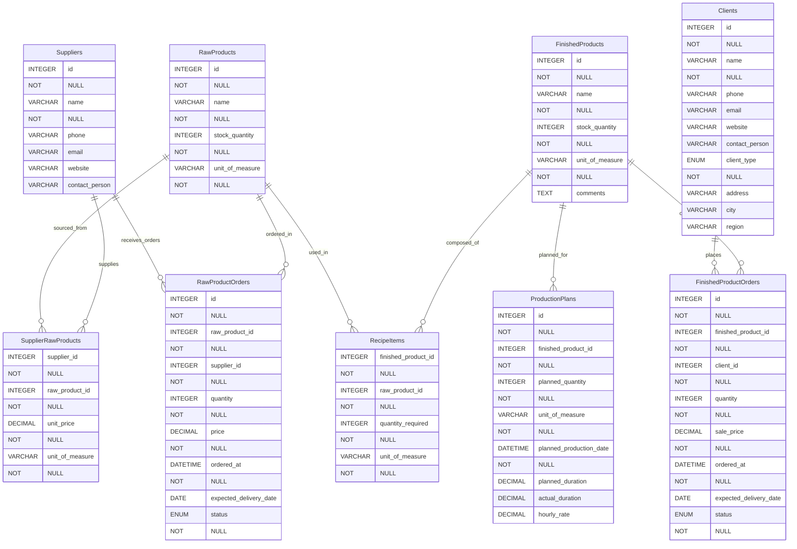

# Stocky backend

Stocky — Track. Manage. Grow.

## 📊 Entity Relationship Diagram (ERD)

The following diagram represents the database structure and relationships
between suppliers, raw products, transformed products, clients, orders,
and production planning.

